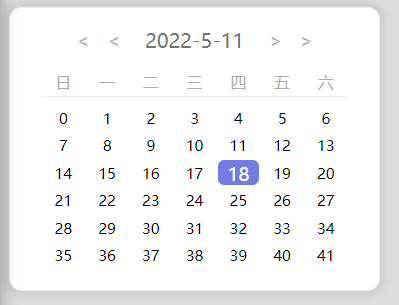
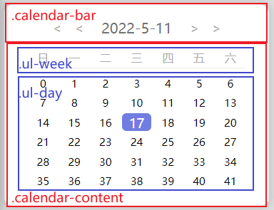
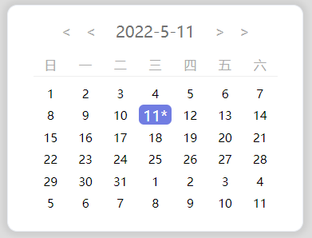
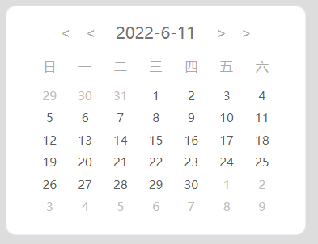
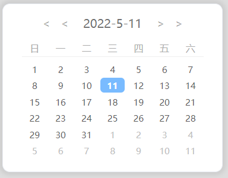

# vue自定义小日历组件
原文链接：[vue自定义小日历组件](https://blog.csdn.net/weixin_41357410/article/details/124721563)
## 一、日历样式

我的这个日历组件主要分为导航栏区和主要内容区，导航栏按钮样式什么的都是自定义的，很简单，源码有就不罗嗦。主要讲一下日历内容的样式设计。



日历内容都是用`<ul>`和`<li>`标签实现的，星期栏和日期栏分别为独立的`<ul>`,内容为`<li>`，两个`<ul>`均采用网格布局，星期栏1行7列，日期内容为6行7列，在css样式中设置display为`grid`，再分别设置行列属性，`<li>`会自动排布为设定的样式，这里前提是每个`<li>`要设置为`inline-block`排布。



关于`grid`布局可以参考这篇文章：[CSS Grid 网格布局教程 - 阮一峰的网络日志 (ruanyifeng.com)](https://www.ruanyifeng.com/blog/2019/03/grid-layout-tutorial.html) 这篇博客讲得非常好。

template示例（完整版见末尾链接下载）：

```html
<div id="app">
        <div class="calendar-card">
            <div class="calendar-bar">
                <button class="button button-year-minus">&lt;</button>
                <button class="button button-month-minus">&lt;</button>
                <div class="calendar-date">{{date.year}}-{{date.month}}-{{date.date}}</div>
                <button class="button button-month-plus">&gt;</button>
                <button class="button button-year-plus">&gt;</button>
            </div>
            <div class="calendar-content">
                <ul class="ul-week">
                    <li class="li-week" v-for="item in week">{{item}}</li>
                </ul>
                <ul class="ul-day">
                    <li class="li-day" v-for="item in days">{{item}}</li>
                </ul>
            </div>
        </div>
    </div>
```

js代码：

```javascript
var vm = new Vue({
            el:"#app",
            data:{
                date:{
                    year:2022,
                    month:5,
                    date:11
                },
                week:["日","一","二","三","四","五","六"],
                days:[]//用来绑定日期的数组
            }，
            created(){
                for(let i=0;i<42;i++){   //生成日期数组（示范）
                    this.days.push(i)
                }
            }
        })
```

css样式：

```css
.ul-week {
    display: grid;
    width: 245px;
    grid-template-rows: 20px;/*一个值只有一行20px高*/
    grid-template-columns: repeat(7, 35px);/*重复7个值代表7列35px宽*/
    
    list-style: none;/*记得清除ul的li标签的·样式*/
    text-align: center;
    
    font-size: 13px;
    color: #aaa;
    
    margin: 5px 20px 5px 20px;
    padding-inline-start: 0px;/*清除ul多余样式*/
    padding-inline-end: 0px;/*清除ul多余样式*/
    border-bottom: 1px solid #eee;/*分隔线*/
}

.li-week {
    display: inline-block;/*li标签设为行内排列*/
}
/*日期内容样式注释参照上面的自己理解*/
.ul-day {
    display: grid;
    width: 245px;
    grid-template-rows: repeat(6, 22px);/*6行22px高*/
    grid-template-columns: repeat(7, 35px);/*7列35px宽*/
    
    list-style: none;
    text-align: center;
    
    margin: 5px 20px 5px 20px;
    padding-inline-start: 0px;
    padding-inline-end: 0px;
}

.li-day {
    display: inline-block;/*必须设置为行内排布，否则为列排布，日期是竖着显示，虽然再grid布局下看上去一样*/
    font-size: 10px;
    line-height: 22px;
    text-align: center;
    border-radius: 5px;
    margin: 1px;
}
```

## 三、日历实现

### 1.实现显示当月日历

创建两个data的对象：`date`和`current`，`date`用来存放需要切换的日期，`current`用来存放今天的年月日

```javascript
date: {
    year: "",
    month: "",
    date: ""
},
current: {
    year: "",
    month: "",
    date: "",
}
```

我们前面用`days:[]`绑定了日期的`<li>`，总共有`6x7=42`个`<li>`,所以每月只要生成对应的包含42个日期元素的`days`数组，就能够自动更新日历。先不考虑按钮切换年月，先实现本月日历的生成。我们前面讨论的其本质就是生成当月的42元素数组`days`,下面给出的就是实现的代码，注释会介绍：

```javascript
/**
 * 根据参数year和month生成对应年月的日历数组
 */
createCalendar: function (year, month) {
    let d = new Date();         //获得date对象
    d.setFullYear(year);        //设置date为制定年份
    d.setMonth(month);          //设置date为制定月份(0~11)
    d.setDate(1);               //设置为本月第一天，为了是下面计算第一天是星期几
    let dayOfFirstDay = d.getDay();    //获得对应月份第一天是星期几(0~6)
    this.days = []                     //每次生成日历清空日期数组

    //向days数组填充每一个日期，包括上个与的末尾和下个月的开头总共42个日期
    /**
    *如何获得上个月末尾和下个月开头？
    *date对象可以设置年月日，其中设置每月几号为setDate(day) day一般为(1~31)
    *当day为0时，date设置的日期是上个月最后一天
    *当day为-1时，date设置的日期是上个月的倒数第二天，以此类推
    *当day设置超过当月天数时，比如三月的32，则会被设置为四月第一天
    *所以循环42次，每次设置对应的day，就可以生成完整日期数组，包括上月尾巴和下月的开头
    */
    for (let i = 0; i < 42; i++) {
        //每次循环重新设置为每月开头第一天，否则每次循环像本月只有28天，上轮循环到31，切换月份到本月的时候31超过28，date对象的month会被设置为下个月
        d.setDate(1);                      
        //每次循环重新设置月份，因为setDate()为负数或这超过本月天数，date对象的month会被设置成上个月或下个月，然后在下一轮循环就会出错
        d.setMonth(month)                     
        d.setDate(i - dayOfFirstDay + 1) //设置本轮循环对应的day，dayOfFirstDay为本月第一天的星期，本月第一天之前的day小于1，也就是0或者负数，需要减去dayOfFirstDay差+1，这里自己体会
        if (this.current.date == d.getDate() && this.current.month == d.getMonth() && this.current.year == d.getFullYear()) { //此为判断本次循环是否为当天，当天日期可以做标记以高亮显示，如加上“*”号
            this.days.push(d.getDate()+"*")  //往数组里push本次循环的日期
        } else {
            this.days.push(d.getDate())     //往数组里push本次循环的日期
        }
    }

}
```

为了在生成日历组件的同时初始化日历，所以需要在`create()`中做初始化处理

```javascript
created() {
    let d = new Date();
    //初始化标题显示的年月日
    this.date.year = d.getFullYear(); 
    this.date.month = d.getMonth();
    this.date.date = d.getDate();
    
    //初始化今天的年月日
    this.current.year = d.getFullYear();
    this.current.month = d.getMonth();
    this.current.date = d.getDate();
    
    //调用createCalendar()生成本月的日历
    this.createCalendar(this.current.year,this.current.month)
}
```

最后的效果如下：



### 2. 区分本月和其他月

上月末尾日期和下月开头日期与本月日期混在一起，需要做一些样式处理。我们将days数组从原先的存放day数字，改为存放date对象，`{year:"2022",month:"5",date:"11",isThisMonth:false}`，存放年月日，其中`isThisMonth`

为该日期是否是本月的标记，”1“为非本月，”2“为本月。然后通过css选择器属性来实现。

在`createCalendar()`中改成如下代码：

```javascript
createCalendar: function (year, month) {
    let d = new Date();
    d.setFullYear(year);
    d.setMonth(month);
    d.setDate(1);
    let dayOfFirstDay = d.getDay();
    this.days = []
    
    for (let i = 0; i < 42; i++) {
        d.setDate(1);
        d.setMonth(month)
        d.setDate(i - dayOfFirstDay + 1)

        //判断是否为本月并添加标记
        let isThisMonth = 2
        if (d.getMonth() == month) {
            isThisMonth = 2
        } else {
            isThisMonth = 1
        }

        
        if (this.current.date == d.getDate() && this.current.month == d.getMonth() && this.current.year == d.getFullYear()) {
            isThisMonth = 3
            //改为对象
            let date = { year: year, month: month, date: d.getDate(), isThisMonth: isThisMonth }
            this.days.push(date)
        } else {
            //改为对象
            let date = { year: d.getFullYear(), month: d.getMonth(), date: d.getDate(), isThisMonth: isThisMonth }
            this.days.push(date)
        }
```

css运用选择器属性：

```css
.li-day[isThisMonth="1"] {       /*非本月的本月样式*/
    color: rgb(190, 190, 190);
    font-size: 10px;
}

.li-day[isThisMonth="1"]:hover {/*非本月的本月样式hover*/
    background-color: #717de2;
    color: #fff;
    font-size: 15px;
    cursor: pointer;
}
```

对应标签改为：

```html
<ul class="ul-day">
    <li class="li-day" v-for="item in days" :isThisMonth="item.isThisMonth">{{item.date}}</li>
</ul>
```

即可以实现如下的效果：



### 3.高亮今天的日期

我们在2的基础上，在`isThisMonth`判断上再加一个值3，如果当前day是今天，则标记为”3“。在`createCalendar()`判断是否为今天的代码修改为如下（可以把丑陋的"*"去掉了）：

```javascript
 if (this.current.date == d.getDate() && this.current.month == d.getMonth() && this.current.year == d.getFullYear()) {
     //标志为3代表是今天
     isThisMonth=3
     let date = { year: year, month: month, date: d.getDate(), isThisMonth: isThisMonth }
     this.days.push(date)
 }
```

css样式里添加如下代码：

```css
.li-day[isThisMonth="3"] {
    border-radius: 5px;
    color: rgb(255, 255, 255);
    background-color: #79bbff;
    font-weight: 600;
  }
```

则实现了今天的日期高亮的效果：



### 4.实现切换年月从而切换日历

给button绑定事件，本质就是修改data中的`date.year`和`date.month`，并且每次修改年月都要调用`createCalendar()`重新更新日历。代码如下，其中的逻辑很简单，看下代码就懂的：

```javascript
plusMonth: function () {
    if (this.date.month == 11) {
        this.date.month = 0;
        this.plusYear(false) //切换月份超过当年范围会导致年份增减，但是直接调用增减年份的函数会导致日历重复更新，所以在增减年份的函数中添加标志位，flase则不更新日历
    } else {
        this.date.month++;
    }
    this.createCalendar(this.date.year, this.date.month);
},
minusMonth: function () {
    if (this.date.month == 0) {
        this.date.month = 11;
        this.minusYear(false)   //切换月份超过当年范围会导致年份增减
    } else {
        this.date.month--; 
    }
    this.createCalendar(this.date.year, this.date.month);
},
plusYear: function (create) {          //freate为flase则不更新日历
    if (this.date.year == 2049) {
        this.date.year = 1970;
    } else {
        this.date.year++;
    }
    if (create) {
        this.createCalendar(this.date.year, this.date.month);
    }
},
minusYear: function (create) {
    if (this.date.year == 1970) {
        this.date.year = 2049;
    } else {
        this.date.year--;
    }
    if (create) {
        this.createCalendar(this.date.year, this.date.month);
    }
}
```

给每个按钮绑定

```html
<button class="button button-year-minus" @click="minusYear">&lt;</button>
<button class="button button-month-minus" @click="minusMonth">&lt;</button>
<div class="calendar-date">{{date.year}}-{{date.month+1}}-{{date.date}}</div>
<button class="button button-month-plus" @click="plusMonth">&gt;</button>
<button class="button button-year-plus" @click="plusYear">&gt;</button>
```

## 四、高级功能

给每个日期`<li>`点击事件`@click`，绑定`handleClick()`方法

```html
<ul class="ul-day">
    <li class="li-day" v-for="item in days" :isThisMonth="item.isThisMonth" @click="handleClick(item)">{{item.date}}</li>
</ul>
```

添加`handleClick()`方法：

```javascript
 handleClick: function (item) {
     console.log(item.year + "-" + item.month + "-" + item.date)
     alert(item.year + "-" + item.month + "-" + item.date)
 }
```

后续可以在`handleClick()`方法中定制自己的处理，例如点击某天实现某些页面的路由等等，可以将改天的年月日作为参数进行请求，实现`DatePicker`功能。
